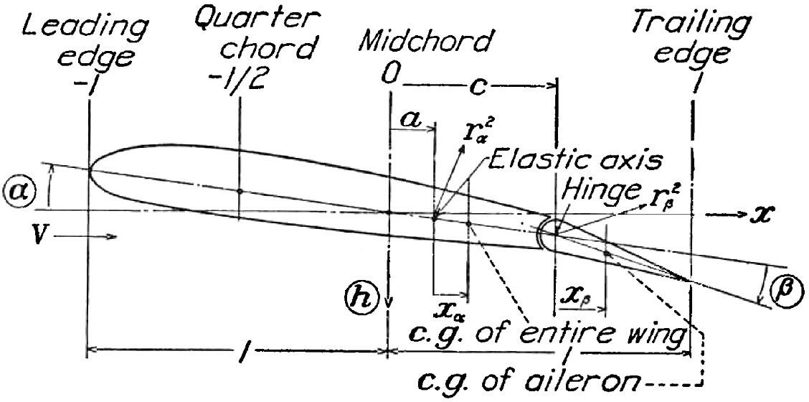

# PyFlutter

Flutter analysis of the 3-DOF flat plate airfoil with Edwards' unsteady aerodynamics.

PyFlutter analyses flutter of the 3-DOF flat plate undergoing pitching, plunging, and trailing edge flapping in potential flow. 
Unsteady aerodynamics are modeled by Edwards' [1] generalized Theodorsen's function, which is valid for arbitrary motion, not just harmonic motion. 
For increasing air speeds, the complex eigenvalues of the dynamical system are computed (root-locus); the system is stable at some given air speed if the three eigenvalues have negative real parts.

## Theory



The flutter problem is formulated with the parameters from Theodorsen [2] (see also the figure from [3]):

* fluid density $`\varrho`$
* semi-chord length $`b`$ of the airfoil
* elastic axis of the airfoil at $`ab`$ downstream from mid-chord
* aileron hinge at $`cb`$ downstream from mid-chord
* mass per span $`M = \mu \pi b^2 \varrho`$ of the airfoil
* static moment per span $`S_\alpha = x_\alpha Mb`$ of the airfoil around the axis
* static moment per span $`S_\beta = x_\beta Mb`$ of the aileron around the hinge
* moment of inertia per span $`I_\alpha = r_\alpha^2 Mb^2`$ of the airfoil around the axis
* moment of inertia per span $`I_\beta = r_\beta^2 Mb^2`$ of the aileron around the hinge
* translational plunging stiffness per span $`C_h = \omega_h^2M`$ of the airfoil
* torsional pitching stiffness per span $`C_\alpha = \omega_\alpha^2I_\alpha`$ of the airfoil around the axis
* torsional flapping stiffness per span $`C_\beta = \omega_\beta^2I_\beta`$ of the aileron around the hinge

At airspeed $`v_\infty=\bar{v}\omega_\text{r}b`$, with Laplace variable $`s=\lambda\omega_\text{r}`$ and reduced Laplace variable $`\bar{s} = sb\textfractionsolidus v_\infty = \lambda\textfractionsolidus\bar{v}`$ the non-dimensional Laplace transformed equations of motion are

$$
\left(
\mathbf{M}_\text{s} \cdot \lambda^2 + 
\mathbf{B}_\text{s} \cdot \lambda +
\mathbf{K}_\text{s} -
\mathbf{Q}(\lambda\textfractionsolidus\bar{v}) \cdot \frac{\bar{v}^2}{\pi\mu}
\right)
\begin{bmatrix} 
h \\
\alpha \\
\beta
\end{bmatrix}
\overset!= \mathbf{0}
$$

where $`hb`$ is the transformed plunging displacement, $`\alpha`$ is the transformed pitching angle, and $`\beta`$ transformed is the aileron flapping angle. 

The non-dimensional structural matrices are

$$
\begin{aligned}
\mathbf{M}_\text{s} &:= \begin{bmatrix}
1 & x_\alpha & x_\beta \\
x_\alpha & r_\alpha^2 & r_\beta^2 + x_\beta(c-a) \\
x_\beta & r_\beta^2 + x_\beta(c-a) & r_\beta^2
\end{bmatrix} \\
\mathbf{B}_\text{s} &:= \begin{bmatrix}
(\omega_\alpha\textfractionsolidus\omega_\mathrm{r}) \\
&(\omega_\alpha\textfractionsolidus\omega_\mathrm{r})r_\alpha^2 \\
&&(\omega_\alpha\textfractionsolidus\omega_\mathrm{r})r_\beta^2
\end{bmatrix} \cdot 2\zeta_\text{s}\\
\mathbf{K}_\text{s} &:= \begin{bmatrix}
(\omega_\alpha\textfractionsolidus\omega_\mathrm{r})^2 \\
&(\omega_\alpha\textfractionsolidus\omega_\mathrm{r})^2r_\alpha^2 \\
&&(\omega_\alpha\textfractionsolidus\omega_\mathrm{r})^2r_\beta^2
\end{bmatrix}
\end{aligned}
$$

Edwards' non-dimensional aerodynamic transfer function matrix [1] is

$$
Q(\bar{s}) =
\mathbf{M}_\text{nc} \bar{s}^2 + 
\mathbf{B}_\text{nc} \bar{s} +
\mathbf{K}_\text{nc} + C(\bar{s}) \cdot 
\mathbf{R}[\mathbf{S}_2 \bar{s} + \mathbf{S}_1]
$$

with Edwards's generalized Theodorsen's function $`C(\bar{s})`$.

For mode-tracking, for each mode, starting at $`\bar{v}=\Delta\bar{v}`$, with the known mode's in-vacuum eigenvalue as guess, the eigenvalue $`\lambda`$ is computed for increasing $`\bar{v}`$ in steps of $`\Delta\bar{v}`$ until either the maximum air speed $`\bar{v}_\text{max}`$ is reached or the damping ratio $`-\mathrm{Re}(\lambda)\textfractionsolidus\vert\lambda\vert`$ is outside $`[\zeta_\text{min}, \zeta_\text{max}]`$.

## Installation

```bash
pip install git+https://github.com/SEhrm/PyFlutter
```

Requires Numpy, Scipy, and optionally Matplotlib for plotting.

## Usage

The root-locus computation can be invoked from the command line with the command `pyflutter` with 
arguments:

* `-a`, `-c`, `-r`, `-rb`, `-x`, `-xb`: $`a`$, $`c`$, $`r_\alpha > 0`$, $`r_\beta > 0`$, $`x_\alpha`$, $`x_\beta`$
* `-m`: $`\mu > 0`$
* `-d`: $`\zeta > 0`$
* `-wa`, `-wh`, `-wb`: $`\omega_\alpha\textfractionsolidus\omega_\text{r} > 0`$, $`\omega_h\textfractionsolidus\omega_\text{r} > 0`$, $`\omega_\beta\textfractionsolidus\omega_\text{r} > 0`$, passing `nan` disables the corresponding degree of freedom
* `--v-step`, `--v-max`: $`\Delta\bar{v} > 0`$, $`\bar{v}_\text{max} > 0`$
* `--d-min`, `--d-max`: $`\zeta_\text{min} > -1`$, $`\zeta_\text{max} < 1`$
* `--plot`: To plot the root-locus with Matplotlib (requires Matplotlib to be installed)

## References

[1] EDWARDS, J W. Unsteady aerodynamic modeling and active aeroelastic control. 1977. (Thesis). https://ntrs.nasa.gov/citations/19780002074

[2] THEODORSEN, T. General theory of aerodynamic instability and the mechanism of flutter. 1949. NACA-TR-496. https://ntrs.nasa.gov/citations/19930090935

[3] THEODORSEN, T; GARRICK, I. E. Mechanism of flutter a theoretical and experimental investigation of the flutter problem. 1940. NACA-TR-685. https://ntrs.nasa.gov/citations/19930091762

## License

Copyright (c) 2026 Simon Ehrmanntraut.

Licensed under the [Creative Commons Attribution-NonCommercial 4.0 International License](LICENSE) (CC BY-NC 4.0). 
You may share and adapt this work for **non-commercial** purposes, provided you give appropriate credit.
